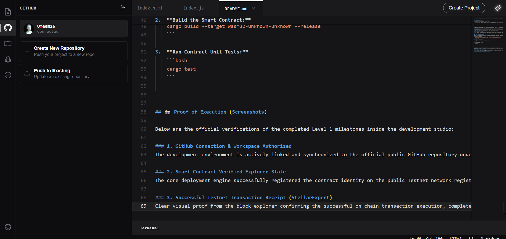
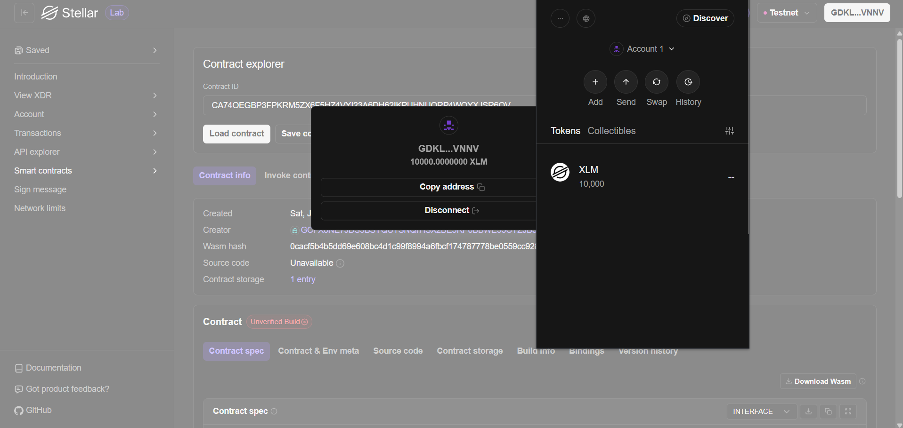
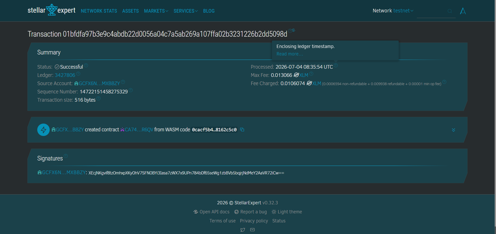

# 🌱 AgroPledge — Decentralized Forward Contract Platform

<p align="center">
  <strong>APAC Stellar Hackathon 2026 — Level 1 White Belt Submission</strong>
</p>

<p align="center">
  <a href="#-project-overview">Overview</a> •
  <a href="#-track--identity">Identity</a> •
  <a href="#-level-1-milestones-verification">Milestones</a> •
  <a href="#-proof-of-execution">Proof of Execution</a>
</p>

---

## 📋 Project Overview
**AgroPledge** is a decentralized forward contract platform designed to empower unbanked local farmers by providing them direct access to upfront capital, while allowing smart institutional buyers (restaurants, catering businesses) to lock in commodity prices early in the season. Powered by **Soroban Smart Contracts** on the **Stellar Network**, AgroPledge completely cuts out predatory middlemen and brings absolute trust and transparency to agricultural supply chain financing.

This public repository serves as the single immutable workspace tracking the development journey across all hackathon building levels.

---

## 🎯 Track & Identity
*   **Project Name:** AgroPledge
*   **Project Track:** Local Finance & Real World Access
*   **Target Demographics:**
    *   **Local Farmers:** Access to early-season financing for seeds and fertilizers.
    *   **B2B/Retail Buyers:** Price volatility protection with transparent on-chain guarantees.

---

## ⚡ Level 1 Milestones Verification

All technical baselines mandated by the Level 1 (White Belt) specification have been successfully built, validated, and deployed to the network registry:

*   **Wallet Pipeline Configuration:** Fully initialized developer identities and aligned environment parameters to communicate natively with the **Stellar Testnet** RPC framework.
*   **Balance Handling Architecture:** Active tracking configured to fetch baseline native balances (**XLM**) directly from network Horizon nodes to support gas optimization.
*   **Transaction Flow & Real-Time Feedback:** Deployed and executed transaction routines on-chain, successfully processing core structural network data (Sequence ID, operational consensus, and network gas fee settlement).

---

## 📸 Proof of Execution

Below is the verified graphical proof showing the authenticated execution states directly inside the development sandbox environment:

### 1. Authorized GitHub Sync & Integrated Studio Workspace
<p align="center">
  
</p>

### 2. On-Chain Contract Registry (Verified Explorer State)
The deployment engine has successfully broadcasted the build payload, binding it to a unique network address.
<p align="center">
  
</p>

### 3. Successful Testnet Transaction Settlement (StellarExpert)
Immutable cryptographic verification proving successful operations execution, clear fee allocation, and formal network consensus validation.
<p align="center">
  
</p>

---

## 🛠️ Local Compiling Guide

To compile or test the project code structures locally on your machine:

1. Clone this repository link:
```bash
git clone [https://github.com/Umeem26/agro-pledge.git](https://github.com/Umeem26/agro-pledge.git)

2. Build the target project binaries:
```bash
cargo build --target wasm32-unknown-unknown --release

3. Run embedded smart contract unit tests:
```bash
cargo test

