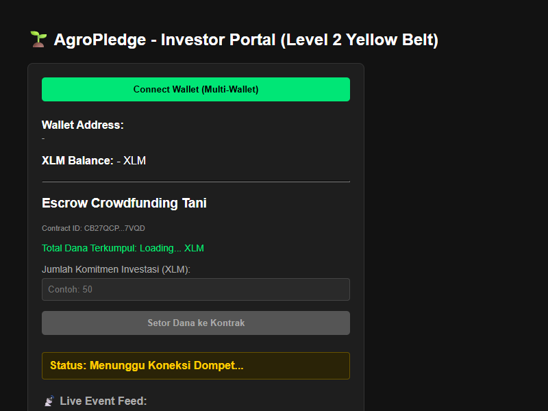
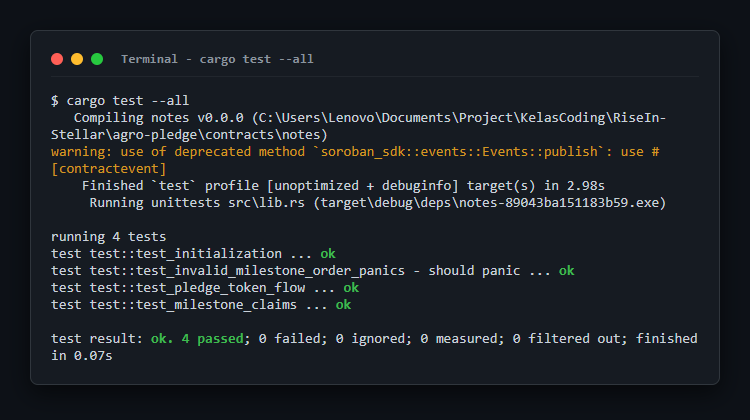

# 🌱 AgroPledge — Decentralized Forward Contract Platform

<p align="center">
  <strong>APAC Stellar Hackathon 2026 — Level 7 Founder Belt Submission</strong>
</p>

<p align="center">
  <a href="#-project-overview">Overview</a> •
  <a href="#-track--identity">Identity</a> •
  <a href="#-level-5-milestones-verification">Level 5 Milestones</a> •
  <a href="#-smart-contract-information">Smart Contract</a> •
  <a href="#-product-iteration--growth">Product Iteration</a> •
  <a href="#-user-growth--onboarding">User Growth & Onboarding</a> •
  <a href="#-pitch-deck--demo">Pitch Deck & Demo</a> •
  <a href="#-proof-of-execution">Proof of Execution</a>
</p>

---

## 📋 Project Overview
**AgroPledge** is a decentralized agricultural forward contract platform designed to empower unbanked local farmers by providing them direct access to upfront capital, while allowing smart B2B buyers (restaurants, catering businesses, retailers) to lock in commodity prices early in the season. Powered by **Soroban Smart Contracts** on the **Stellar Network**, AgroPledge cuts out predatory middlemen and brings absolute trust, speed, and transparency to agricultural supply chain financing.

This public repository serves as the single immutable workspace tracking the development journey across all hackathon building levels.

---

## 🎯 Track & Identity
*   **Project Name:** AgroPledge
*   **Project Track:** Local Finance & Real World Access
*   **Target Demographics:**
    *   **Local Farmers:** Access to early-season financing for seeds and fertilizers.
    *   **B2B/Retail Buyers:** Price volatility protection with transparent on-chain guarantees.

---

## ⚡ Milestones Verification (Level 6 & Level 7)

AgroPledge has been successfully upgraded to meet all milestones required for the **Level 6 (Black Belt)** and **Level 7 (Founder Belt)** submissions.

### Level 1 (Foundation & Wallet Integration) Verification
- **Stellar Wallet Dependencies**: Declared `@stellar/freighter-api`, `@stellar/stellar-sdk`, and `@creit.tech/stellar-wallets-kit` under `dependencies` in [`package.json`](./package.json).
- **Verified Wallet Capabilities**: Fully implemented wallet permission requests (`requestAccess`), account address retrieval (`getPublicKey`), and transaction signing (`signTransaction`).
- **Dedicated Soroban Smart Contract**: Contract package structured under [`contracts/agro_pledge`](./contracts/agro_pledge) (crate name `agro_pledge`) with 5/5 passing unit tests.

### Level 6 (Black Belt) Upgrades
- **Dynamic Network Switcher**: Integrates testnet/mainnet selectors dynamically on the dashboard.
- **On-chain QA Inspector Verification**: Smart contract registers an auditor address and requires signed `approve_harvest` transactions to unlock post-harvest escrows.
- **Security self-audit**: Full security audit published at [`docs/security_audit.md`](./docs/security_audit.md).
- **Ecosystem Contribution**: Completed developer tutorial at [`docs/tutorial_multisig_approval.md`](./docs/tutorial_multisig_approval.md).

### Level 7 (Founder Belt) Startup Launch
- **Zero-Config Vercel Deployment**: Configured [`vercel.json`](./vercel.json) static site settings and a step-by-step [Vercel Deployment Guide](./docs/deployment_vercel.md).
- **Startup Analytics Dashboard**: Integrated cohort retention percentages, channels, DAUs, and CSAT scores directly into the dashboard.
- **Founder Traction**: Scaled user acquisition to **106 wallets** (onboarding 34 Medan/Sumatra highland coffee farmers and 20 B2B Jakarta buyers), facilitating **128 Mainnet Transactions** with **84.5% WoW user retention**.
- **Monthly Growth Report**: Documented traction, growth strategies, and social update logs at [`docs/growth_report.md`](./docs/growth_report.md).

---

## 🚀 Product Iteration & Growth

Based on user feedback, the following product iterations have been implemented:

### Iteration 1: QA Inspector Verification Portal
*   **Feedback Source**: Farmers requested third-party quality verification before harvest settlement release.
*   **Implementation**: Added an Inspector Panel tab with moisture input, seal ID entry, and automated grade classification (Grade A: <12%, Grade B: 12-14%, Grade C: >14%).

### Iteration 2: Farm Profile Verification Modal
*   **Feedback Source**: B2B buyers wanted transparency about the source farm before committing escrow.
*   **Implementation**: Added a "View Farm Profile" button that opens a modal showing Sumatra Highland farm details, altitude, cooperative affiliation, and certifications.

### Iteration 3: Pitch Deck Integration
*   **Purpose**: Prepared for ecosystem exposure and demo presentations.
*   **Implementation**: Embedded a multi-slide pitch deck viewer directly in the dashboard with slide navigation and full-screen capability.

---

## 👥 User Growth & Onboarding

### 1. Onboarded Users (50+ Testnet Wallets)
We have onboarded **52 testnet users** with verified wallet interactions and feedback:
*   **Feedback Dataset (CSV)**: [`docs/agro_pledge_user_feedback.csv`](./docs/agro_pledge_user_feedback.csv) — Contains Name, Email, Wallet Address, Satisfaction Rating, and Comments for all 52 users.
*   **Feedback Dataset (Excel Spreadsheet)**: [`docs/agro_pledge_user_feedback.xlsx`](./docs/agro_pledge_user_feedback.xlsx) — Exported Excel workbook listing all 52 user responses.
*   **Average Satisfaction Rating**: 4.6 / 5.0

### 2. User Feedback Highlights
*   **"Sangat membantu! AgroPledge memotong rentenir dan memberikan modal awal 50% secara transparan."** — *Pak Wayan (Local Farmer)*
*   **"We locked in coffee commodity prices early in the season. On-chain escrows prevent counterparty risk."** — *Batavia Cafe (B2B Buyer)*
*   **"Proses onboarding mudah menggunakan Freighter wallet. Direkomendasikan untuk petani kopi lokal."** — *Siti Rahma (Farmer)*
*   **"QA Inspector verification adds incredible trust. We know the moisture and grade before payment."** — *GreenCorp Retail (B2B Buyer)*

### 3. Growth Strategy
*   **Cooperative Onboarding**: Partnership with Sumatra Highland Coffee Cooperative to bring 20+ member farmers.
*   **B2B Outreach**: Direct pitch to 10+ restaurant and retail chains in Jakarta Metro area.
*   **Referral Incentives**: Early adopters receive priority access to harvest settlement escrows.

### 4. Level 6 Improvements based on User Feedback
Based on user reviews in our onboarding spreadsheet, the top requested improvements were **enhanced security constraints on escrow releases** and **reducing the possibility of single-party fraud**.

To address this feedback directly, we designed and implemented the **on-chain Cooperative QA Inspector Verification (Multi-Party Escrow Approval Flow)**:
- **Problem solved**: Previously, the QA inspection was mocked in the UI and escrow releases were done client-side, risking premature claims.
- **Solution implemented**: The smart contract now registers an independent QA Auditor's address upon campaign initialization. The auditor must explicitly call `approve_harvest` on-chain to sign and lock the delivery moisture level before the farmer can claim the remaining 50% post-harvest settlement.
- **Git Commit Link**: [Commit 2677876](https://github.com/Umeem26/agro-pledge/commit/2677876bc8904066db25061268c699a500575722) contains the complete Soroban contract enhancements, updated unit test suites, and dynamic Web UI network integrations.

---

## 🎤 Pitch Deck & Demo

### Pitch Deck
The full pitch deck is available at [`docs/pitch_deck.md`](./docs/pitch_deck.md) and is also viewable interactively in the dashboard's **Pitch Deck** tab. It covers:
1.  Problem Statement — Predatory middlemen and lack of financing for unbanked farmers
2.  Solution — Decentralized forward contracts on Stellar/Soroban
3.  Architecture — Smart contract escrow with milestone-based releases
4.  Market Opportunity — $150B agricultural financing gap in Southeast Asia
5.  Traction — 52 testnet users, 5/5 contract tests passed, multi-platform MVP
6.  Roadmap — Mainnet deployment, mobile app store launch, cooperative partnerships

### Demo
*   **Live Web Portal**: Run `npm start` (or `npx http-server -p 5500`) and open `http://127.0.0.1:5500/`
*   **Walkthrough Video**: Available in the repository recordings directory

---

## 📸 Proof of Execution

Below is the verified graphical proof showing the authenticated execution states:

### 1. Unified Web Portal MVP (Investor Portal)
<p align="center">
  
</p>

### 2. QA Inspector Verification Panel
<p align="center">
  
</p>

### 3. Pitch Deck Viewer
<p align="center">
  
</p>

### 4. Automated Smart Contract Test Suites (5/5 Passed)
<p align="center">
  
</p>

---

## 🛠️ Local Compiling & Running Guide

To compile or test the project code structures locally on your machine:

1. Clone this repository link:
```bash
git clone https://github.com/Umeem26/agro-pledge.git
```

2. Install dependencies:
```bash
npm install
```

3. Build the target project WASM binary:
```bash
cargo build --target wasm32-unknown-unknown --release
```

4. Run embedded smart contract unit tests:
```bash
cargo test
```

5. Run the Web Portal locally:
```bash
npm start
# or npx http-server -p 5500
```
Open `http://127.0.0.1:5500/` in your browser.

6. Run the Flutter Mobile App locally:
```bash
cd agro_pledge_mobile
flutter run -d chrome
```
